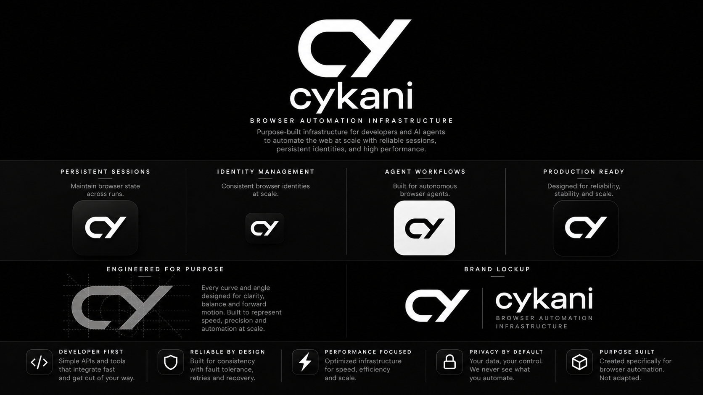

# Cykani

Browser infrastructure for AI agents.

Build, run, and scale browser automation with a reliable runtime designed for modern web workflows.

  

---

## What is Cykani?

Cykani provides the infrastructure layer for browser-based automation.

Whether you're building AI agents, automation systems, testing platforms, or data workflows, Cykani helps you execute browser tasks reliably at scale.

---

## Built For

- AI Agents
- Browser Automation
- Web Workflows
- End-to-End Testing
- Data Extraction
- Process Automation

---

## Products

### Cykani Browser

Purpose-built browser runtime for modern automation workloads.

- Reliable browser execution
- Session persistence
- Production-grade stability
- Scalable browser infrastructure
- Designed for agent workflows

### Cykani SDK

Developer-first tooling for building browser-powered applications.

- Simple APIs
- Fast integration
- Local and cloud execution
- Agent-friendly architecture
- Modern developer experience

---

## Why Cykani?

Building browser automation in production is hard.

Cykani handles the browser layer so developers can focus on building products, agents, and workflows.

---

## Vision

Create the infrastructure platform powering the next generation of browser-native AI agents.

---

Reliable browser infrastructure.
Built for developers.
Designed for agents.
